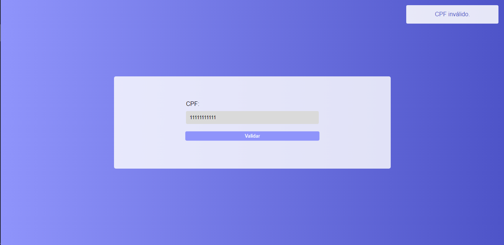

# Valida CPF

<!---Esses são exemplos. Veja https://shields.io para outras pessoas ou para personalizar este conjunto de escudos. Você pode querer incluir dependências, status do projeto e informações de licença aqui--->

> Projeto desenvolvido por mim.

## 📝 Descrição
Este é um projeto desenvolvido somente com HTML, CSS e JS, feito para estudo. O Valida CPF, como diz o nome, faz um análise por meio de cálculos e retorna se o CPF é válido ou não. Essa ferramenta é feita somente para ESTUDOS, sem intenção alguma de obtenção de dados de usuários.

## 📷 Fotos

> Parte inicial da homepage.

## 💻 Pré-requisitos

* Esse projeto não necessita de nenhuma aplicação externa. :) 

## 🔗 Visualização

* Para visualizar este projeto, acesse clicando [aqui!](https://valida-cpf.vercel.app/)

## 🤝 Colaboradores

Agradecemos às seguintes pessoas que contribuíram para este projeto:

<table>
  <tr>
    <td align="center">
      <a href="#">
         
        
          <b>Kauã Nunes</b>
        
      </a>
    </td>
  </tr>
</table>

## 📝 Licença

MIT

[⬆ Voltar ao topo](#elixr) 